# Snaplock

**Monetize your photos, videos, files & documents with ease.** [Snaplock](https://snaplock.org/) is a full-stack content monetization platform where creators sell individual photos, video, and bundles behind a paywall — with secure checkout, instant delivery, and creator payouts. Built solo, end to end: frontend, backend, payments, storage infrastructure, and the edge proxy that serves the content.

  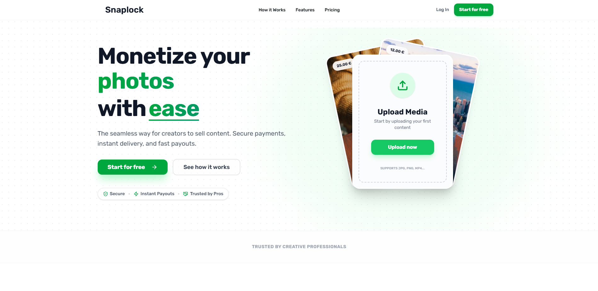

## What it does

A creator signs up, uploads their media, sets a price, and shares a link. A buyer checks out as a guest (no account needed), pays with their preferred method, and gets instant, tracked access to the files. The creator sees the sale land in their wallet and can cash out to PayPal, bank, or crypto.

- **Creator storefronts** — public profile pages (`/u/[username]`) listing products and discounted bundles
- **Guest checkout** — no account required to buy; order tracked by email + secure token
- **Multi-provider payments** — Stripe, PayPal, and Mollie, plus Apple Pay / Google Pay via Stripe
- **Creator wallet & payouts** — per-sale ledger (fees, refunds, holds) with payout requests to bank transfer, PayPal, or crypto
- **Proof of delivery** — every page view, download, and email is logged per order for dispute protection
- **Analytics** — views, unique visitors, conversion rate, and traffic sources per creator, with a live "visitors now" counter
- **Reviews** — buyers can rate and review purchased products/bundles
- **Admin panel** — user search, KYC/approval workflow, moderation
- **i18n** — English, German, French, Spanish, Italian, with locale-aware routing and country-based redirect
- **Guided onboarding** — collects seller intent/plan answers before granting selling access

## Screenshots

<table>
<tr>
<td>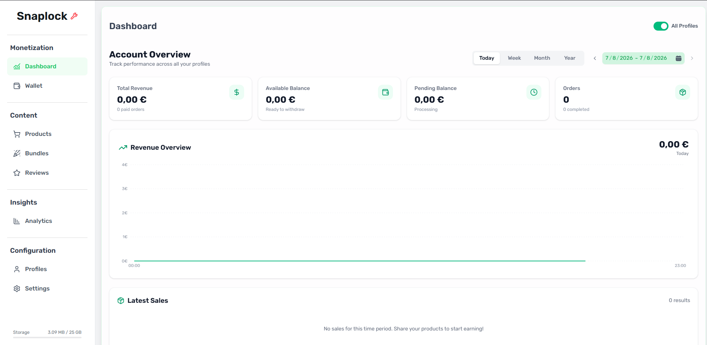</td>
<td>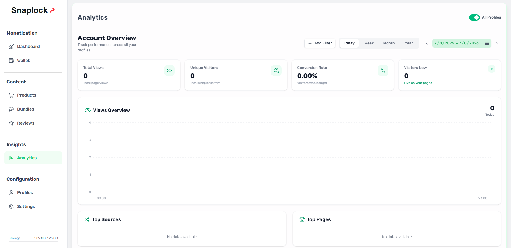</td>
</tr>
<tr>
<td align="center">Creator dashboard — revenue, balances, orders</td>
<td align="center">Analytics — views, visitors, conversion, sources</td>
</tr>
<tr>
<td>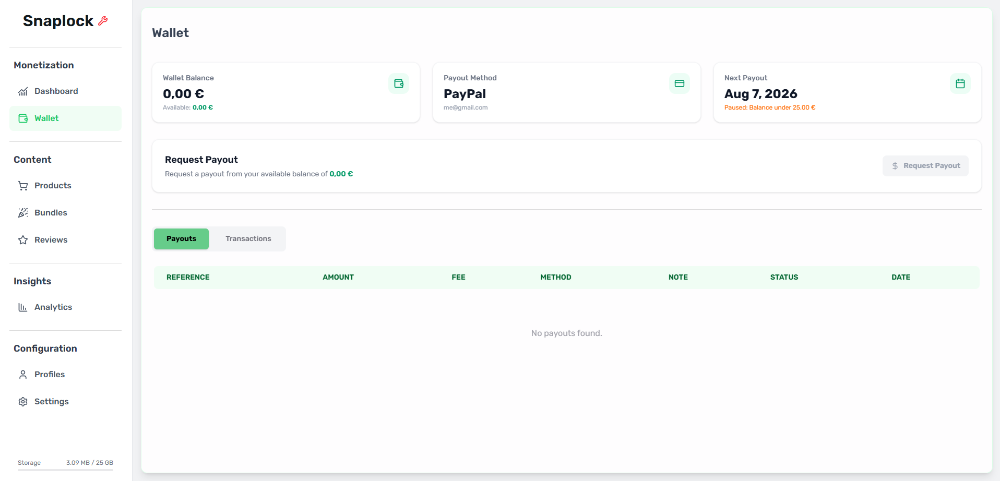</td>
<td>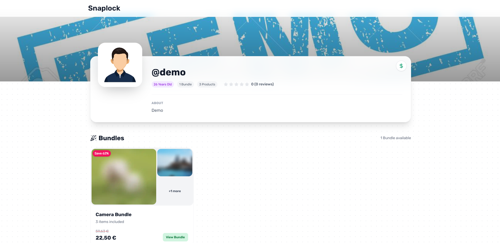</td>
</tr>
<tr>
<td align="center">Wallet — balance, payout method, payout history</td>
<td align="center">Public storefront with bundles</td>
</tr>
<tr>
<td>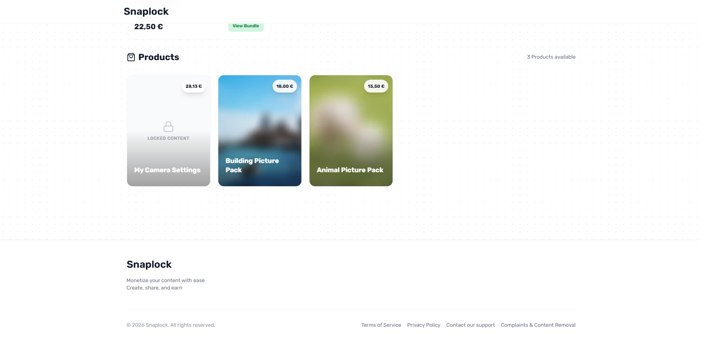</td>
<td>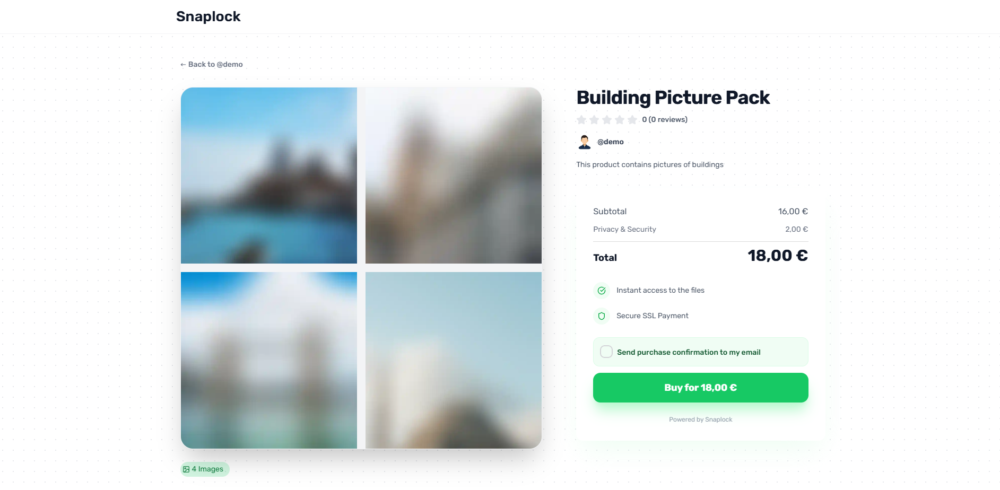</td>
</tr>
<tr>
<td align="center">Locked/blurred product previews</td>
<td align="center">Product page — blurred preview + price breakdown</td>
</tr>
<tr>
<td>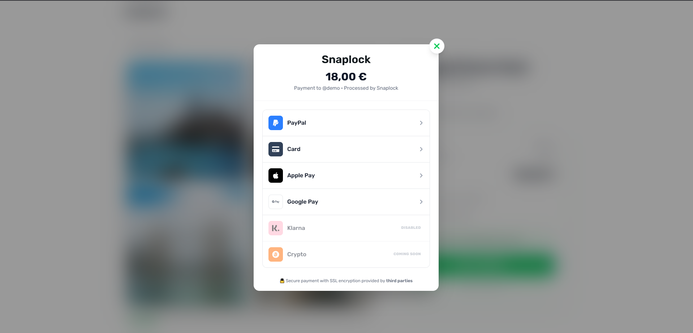</td>
<td>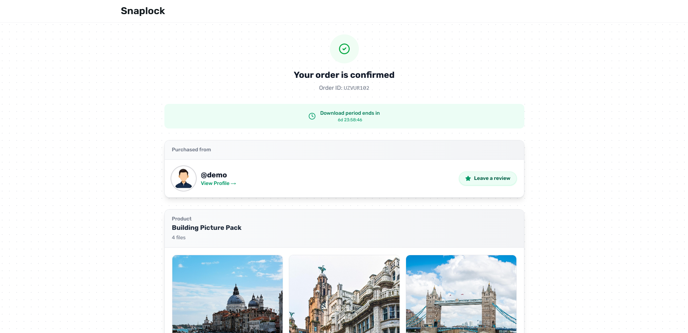</td>
</tr>
<tr>
<td align="center">Checkout — card, PayPal, Apple/Google Pay</td>
<td align="center">Order confirmation with time-boxed download access</td>
</tr>
<tr>
<td>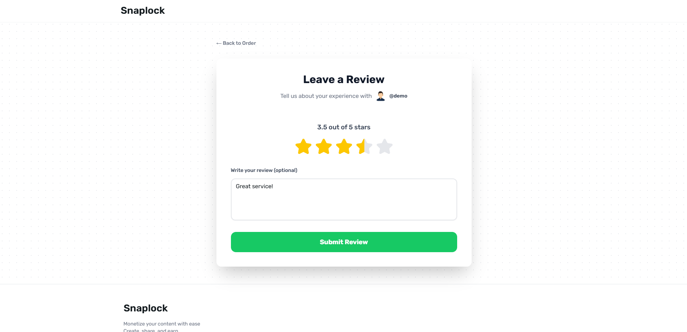</td>
<td></td>
</tr>
<tr>
<td align="center">Post-purchase review flow</td>
<td></td>
</tr>
</table>

## Architecture

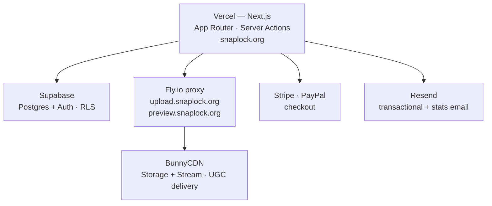

- **Frontend & backend** — [Next.js](https://nextjs.org/) (App Router) on [Vercel](https://vercel.com/), with [HeroUI](https://heroui.com/) + Tailwind CSS for the UI and [Zustand](https://github.com/pmndrs/zustand) for client state. Server Actions handle mutations (`actions/`) instead of a separate API layer for most flows.
- **Database & auth** — [Supabase](https://supabase.com/) (Postgres) for all persistent data, with Row-Level Security policies enforcing that creators only see their own orders, wallets, and analytics. Auth is Supabase Auth, wired through `@supabase/ssr` middleware.
- **Content storage & delivery** — [BunnyCDN](https://bunny.net/) for both static storage and video streaming (`bunny_storage` / `bunny_stream`), so uploaded media is served from the edge without hitting the app server.
- **Edge proxy** — a small Node/Express service deployed as a container on [Fly.io](https://fly.io/), split by subdomain (`upload.snaplock.org`, `preview.snaplock.org`). It handles JWT-authorized direct-to-Bunny uploads and generates blurred/watermarked previews for locked content, keeping upload credentials off the main app.
- **Payments** — Stripe (cards, Apple Pay, Google Pay) and PayPal run behind a single checkout, each reconciled into the same `orders` / `wallet_transactions` ledger via webhooks.
- **Money model** — every sale is an immutable ledger entry (`wallet_transactions`) with clear states (`completed`, `frozen`, `failed`, `billed`); payouts are separate requests against the ledger balance, never a direct mutation of it.
- **Content protection** — sold files are copied into an immutable, deduplicated archive (`product_file_archives`, hashed) so a creator editing/deleting a live product can never affect a buyer's already-purchased download.
- **Delivery evidence** — every page view, file download, and confirmation email is written to an `order_logs` table, giving creators a paper trail for chargeback/dispute defense.
- **Email & ops automation** — [Resend](https://resend.com/) sends order confirmations and creator stats digests; scheduled cron jobs (`app/api/cron`) trigger the monthly stats email and roll up analytics via a Postgres RPC function.

## Tech stack

### Languages & Runtimes

### Frontend

HeroUI · Framer Motion · Recharts · Zustand · React Hook Form + Zod

### Backend & Data

Server Actions · Row-Level Security · Postgres RPC functions

### Infra & Deployment

Fly.io (proxy container)

### Payments & Services

   

### i18n

en · de · fr · es · it — via i18next / react-i18next

## Notable engineering details

- **Guest-friendly but locked down** — buyers never need an account, yet `orders`/`order_items` explicitly deny direct client inserts (service-role only), so the entire write path for money-moving tables runs through server-verified logic.
- **Smart archive expiry** — archived files carry a "last active expiry" that extends automatically whenever a new order references the same content, so storage isn't purged out from under a still-valid download link.
- **Multi-profile support** — a single account can run several public creator profiles, with dashboard/analytics toggles to view "All Profiles" or drill into one.
- **Locale-aware routing** — middleware maps visitor geolocation to a supported locale and persists the choice in a cookie, falling back cleanly for demo/preview/API routes that must bypass i18n.
